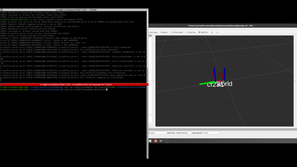

# Test the Simulator


## 1. Export the crazyflie-firmware path
export PYTHONPATH=~/crazyflie-firmware/build:$PYTHONPATH
## 2. Source the crazyswarm2 ROS workspace
source ~/crazyflie-ws/install/setup.bash
## 3. Run the simulator.
### 1. Open a terminal window and issue the following command to launch the simulator:
ros2 launch crazyflie launch.py backend:=sim
### 2. Open a terminal window and issue the following command to execute an example of takeoff and landing:
ros2 run crazyflie_examples hello_world --ros-args -p use_sim_time:=True
### 3. The drone should take off and then land after 5 seconds.


## Reference
https://imrclab.github.io/crazyswarm2/usage.html#simulation

# Test the installation with a drone (Flow Deck v2)
To use the drone, it needs to have at least one positions system enabled from the list of supported systems. The following instructions have been tested with the Flow Deck v2. For more information about the supported systems, see the following link: https://www.bitcraze.io/documentation/system/positioning/

## 1. Export the crazyflie-firmware path
export PYTHONPATH=~/crazyflie-firmware/build:$PYTHONPATH
## 2. Source the crazyswarm2 ROS workspace
source ~/crazyflie-ws/install/setup.bash
## 3. Connect the crazy radio and setup the correct parameteres in the yaml file.
Modify the file crazyflies.yaml located in ~/crazyflie-ws/src/crazyswarm2/crazyflies.yaml and configure the following variables accordingly:
- uri
- type
- motion_capture->enabled (set true or false if you are using motion capture or not)
- firmware_logging->enabled (set true or false if you are logging the data)
- firmware_params->stabilizer->estimator (set to 2)
- firmware_params->stabilizer->controller (set to 1)
## 4. Launch the package with the desired backend.
Once the setup is complete, you can launch the package with the desired backend. For example, to launch the package with the cflib backend, execute the following command in a terminal:

```ros2 launch crazyflie launch.py backend:=cflib```

- **Note:** For more information about which backend to use, see the following link: https://imrclab.github.io/crazyswarm2/overview.html#support-functionality-with-backends. Each backend will enable different topics, services, and levels of control.

In another terminal, execute the executable to run the example script.

```ros2 run crazyflie_examples hello_world```

The drone should take off and then land after 5 seconds.




## Reference
https://imrclab.github.io/crazyswarm2/usage.html#physical-experiments

# Control the drone

## Manual takeoff
ros2 service call cf1/takeoff crazyflie_interfaces/srv/Takeoff "{height: 0.5, duration: {sec: 2}}"

## Manual landing
ros2 service call cf1/land crazyflie_interfaces/srv/Land "{height: 0.0, duration: {sec: 2}}"